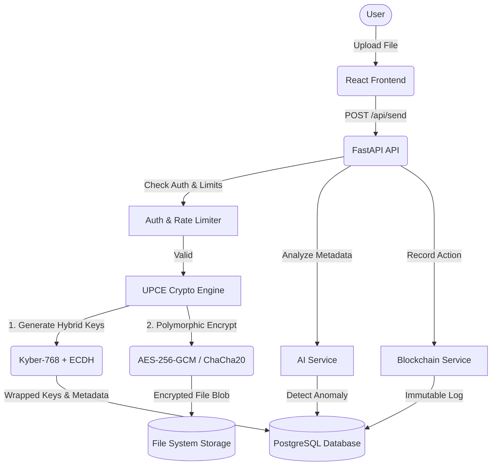

# Project Documentation

## 1. Project Overview

**Project Name:** AI-Enhanced Secure File Transfer System
**Purpose:** Provide a highly secure, modern file transfer application that mitigates both conventional and future quantum computing threats. 
**Main Problem it Solves:** Securely transmitting sensitive data over networks while ensuring data integrity, thwarting man-in-the-middle attacks, and providing deep auditability and anomaly detection.
**Main Features:** 
- Hybrid Post-Quantum Cryptography (PQC) integration (Kyber-768 + ECDH).
- Polymorphic File Encryption (AES-256-GCM & ChaCha20-Poly1305).
- Multi-Factor Authentication (MFA) via OTP.
- AI-driven Malware & Anomaly Detection.
- Immutable Blockchain Audit Logs.
- Secure Share Links.
**Target Users:** Enterprises, individuals, and organizations handling highly sensitive, confidential, or classified data.
**Overall Workflow:** Users authenticate (with MFA), upload a file which is dynamically encrypted (using polymorphic ciphers and PQC/ECDH key wrapping), and transferred. The system logs the transfer in a blockchain ledger and scans for anomalies. Recipients use their private keys to unwrap the encryption key and decrypt the payload.

---

## 2. Technology Stack

| Component | Technology | Version | Purpose |
| --- | --- | --- | --- |
| **Backend Framework** | FastAPI | 0.115.6 | High-performance Python web framework for API routes |
| **Frontend Framework** | React + Vite | React 18.3.1 | UI library and fast build tool for the frontend |
| **Styling** | Tailwind CSS | 3.4.17 | Utility-first CSS framework for UI styling |
| **Database (Prod)** | PostgreSQL | 15 (Docker) | Relational database for production deployment |
| **Database (Dev)** | SQLite | Native | Local database for development and testing |
| **In-Memory Store** | Redis | 7 | Caching, Rate limiting, and Session management |
| **ORM** | SQLAlchemy | 2.0.36 | Database interaction and migrations |
| **Authentication** | JWT & PyOTP | PyJWT 2.10.1 | Token-based auth and Time-based One-Time Passwords |
| **Cryptography** | Python Cryptography, liboqs (optional) | 44.0.0 | Classical and Post-Quantum Cryptographic primitives |
| **AI / ML** | Scikit-Learn, Pandas, Joblib | 1.6.1 | Anomaly and Malware detection models |
| **Deployment** | Docker & Docker Compose | 3.8 | Containerization and orchestration |

---

## 3. Complete Project Structure

```text
c:\RP3\ai-secure-file-transfer-system\
├── .github/                   # GitHub Actions / workflows
├── backend/                   # FastAPI Backend
│   ├── app/
│   │   ├── core/              # Config, Rate Limiter, Redis client
│   │   ├── database/          # SQLAlchemy Models, DB Connection, Seeding
│   │   ├── ml/                # Dataset (lab_secure_transfer_dataset.csv)
│   │   ├── routes/            # API Endpoints (auth, files, logs, etc.)
│   │   ├── schemas/           # Pydantic schemas for request/response validation
│   │   ├── scripts/           # Utility scripts
│   │   ├── services/          # Business logic (Crypto, AI, Blockchain, PFCE, UPCE)
│   │   ├── storage/           # Directory for encrypted files and keys
│   │   └── main.py            # FastAPI entry point
│   ├── generate_graphs.py     # Script to generate charts
│   ├── benchmark_runner.py    # Performance benchmarking scripts
│   ├── smoke_test.py          # E2E Smoke testing
│   ├── requirements.txt       # Python dependencies
│   ├── Dockerfile             # Backend Docker container definition
│   └── .env.example           # Backend environment variables template
├── frontend/                  # React Frontend
│   ├── src/
│   │   ├── api/               # Axios API client setup
│   │   ├── auth/              # Authentication context/utilities
│   │   ├── components/        # Reusable UI components (Layout, ProtectedRoute)
│   │   ├── pages/             # Main Views (Dashboard, Vault, SendFile, Logs, etc.)
│   │   ├── App.jsx            # React Router setup
│   │   ├── main.jsx           # React DOM entry point
│   │   └── index.css          # Tailwind CSS entry
│   ├── package.json           # Node dependencies
│   ├── vite.config.js         # Vite configuration
│   └── Dockerfile             # Frontend Docker container definition
├── docker-compose.yml         # Container orchestration configuration
└── README.md                  # Main project readme
```

---

## 4. System Architecture

The architecture follows a standard 3-tier structure enhanced with specialized security and AI services.

**Flow:**
`Frontend (React)` → `REST API (FastAPI)` → `Services (Crypto/AI/Blockchain)` → `Database (PostgreSQL/SQLite)`

1. **Frontend:** React SPA communicates with the backend via RESTful JSON APIs using Axios.
2. **Backend API:** FastAPI handles routing, rate-limiting, and Pydantic validation.
3. **Services Layer:** Contains discrete modules:
   - **UPCE/Crypto Service:** Handles AES/ChaCha encryption and ECDH/Kyber-768 key encapsulation.
   - **AI Service:** Scans file metadata and behaviors for anomalies.
   - **Blockchain Service:** Writes tamper-proof audit logs for significant events.
   - **Auth Service:** Manages JWT creation, MFA, and user roles.
4. **Data Layer:** SQLAlchemy maps Python objects to the underlying database tables. Local storage is used for encrypted file blobs (`app/storage/encrypted_files`).

---

## 5. Backend Documentation

- **Framework:** FastAPI
- **Entry Point:** `backend/app/main.py`
- **Configuration:** Managed via Pydantic Settings (`core/config.py`), reading from `.env`.
- **Controllers/Routes:** Grouped by domain in `app/routes/`.
- **Services:** Heavy business logic resides in `app/services/` (e.g., `upce_quantum_service.py`, `ai_service.py`).
- **Models:** Defined in `app/database/models.py`.
- **Authentication:** JWT Bearer tokens with Role-Based Access Control (RBAC).

### Key API Endpoints

| Method | Endpoint | Purpose | Authentication | Request | Response |
| --- | --- | --- | --- | --- | --- |
| `POST` | `/api/register` | Register a new user | None | User Registration Data | User + Token |
| `POST` | `/api/login` | Login and get MFA challenge | None | Email + Password | MFA Challenge/Token |
| `POST` | `/api/verify-mfa` | Verify OTP and get JWT | None | User ID + OTP | JWT Token |
| `GET`  | `/api/me` | Get current user info | Required | None | User details |
| `POST` | `/api/send` | Encrypt and transfer file | Required | Multipart Form Data | Transfer Result |
| `GET`  | `/api/received` | List received files | Required | None | List of Transfers |
| `GET`  | `/api/{transfer_id}/download` | Download and decrypt | Required | Path param | Decrypted File Stream |
| `GET`  | `/api/blockchain` | Get blockchain audit logs | Required | None | List of Logs |
| `GET`  | `/api/ai-alerts` | Get AI security alerts | Required | None | List of Alerts |
| `GET`  | `/api/summary` | Dashboard statistics | Required | None | Stats Object |

---

## 6. Frontend Documentation

- **Framework:** React 18 with Vite.
- **Styling:** Tailwind CSS + Lucide Icons.
- **Entry Point:** `src/main.jsx` -> `src/App.jsx`
- **Pages:** 
  - `Login.jsx` & `Register.jsx`: Auth flow.
  - `VerifyOTP.jsx`: MFA step.
  - `Dashboard.jsx`: Overall metrics and recent alerts.
  - `SendFile.jsx`: File upload with encryption controls.
  - `FileVault.jsx` / `ReceivedFiles.jsx`: View and download transfers.
  - `BlockchainLogs.jsx` & `TransferLogs.jsx`: Audit trails.
- **Routing:** React Router v6. Protected routes ensure authentication before access.
- **API Communication:** Axios setup in `src/api/client.js` with JWT interceptors.

---

## 7. Database Documentation

**Database Types:** PostgreSQL (Docker/Prod) or SQLite (Local Dev fallback).
**ORM:** SQLAlchemy

### Key Database Models (`models.py`)

| Model | Purpose | Important Fields | Relationships |
| --- | --- | --- | --- |
| `User` | User accounts & roles | `email`, `password_hash`, `mfa_enabled`, `role` | `sent_transfers`, `received_transfers` |
| `MfaChallenge` | OTP session tracking | `otp_hash`, `expires_at`, `failed_attempts` | `User` |
| `Transfer` | Core file transfer record | `file_name`, `encrypted_path`, `encrypted_key`, `nonce`, `status` | `Sender (User)`, `Receiver (User)`, `AIAlert` |
| `BlockchainLog`| Immutable audit log | `event_type`, `previous_hash`, `block_hash`, `details` | None |
| `AIAlert` | Anomaly detection alerts | `level`, `reason`, `score` | `Transfer`, `User` |
| `AuditBlock` | Blockchain ledger blocks| `event_type`, `block_hash`, `previous_hash` | None |

---

## 8. Authentication and Authorization

- **Login Flow:** User provides credentials -> Backend validates hash -> Backend generates OTP & sends via Email -> User inputs OTP -> Backend returns JWT.
- **Password Hashing:** Handled securely via Cryptography (Bcrypt/Argon2 abstraction).
- **JWT Handling:** Short-lived tokens.
- **Roles:** `user`, `admin`. Admin routes (e.g., viewing all users) are guarded.
- **MFA/OTP:** IMPLEMENTED. Utilizes email to send OTP. Managed by `MfaChallenge` table. Lockout mechanisms exist (`AUTH_MAX_FAILED_LOGINS`, `AUTH_LOCKOUT_MINUTES`).
- **Rate Limiting:** IMPLEMENTED via `InMemoryRateLimitMiddleware` (can be backed by Redis in prod).

---

## 9. Security Architecture

- **Universal Polymorphic Cryptographic Engine (UPCE):** 
  - Generates classical ECDH (X25519) and Post-Quantum (Kyber-768) key pairs.
  - If `liboqs` is missing, Kyber-768 falls back to a software Mock to ensure continuous operation.
- **Polymorphic File Encryption:** 
  - Dynamically selects between `AES-256-GCM` and `ChaCha20-Poly1305` per file chunk.
- **Key Wrap:** AES/ChaCha keys are encapsulated using HKDF derived from the combined ECDH + Kyber shared secrets.
- **Integrity Verification:** Blockchain ledger logs file hashes (`original_hash`), which are verified post-decryption.
- **Audit:** Every critical action (Login, Transfer, Access) writes an `AuditBlock`.

---

## 10. File Transfer Workflow

1. **User Upload:** User selects a file in `SendFile.jsx`.
2. **Encryption Context:** File stream hits `CryptoService.encrypt_file_for_receiver`.
3. **Dynamic Encryption:** File is read in chunks. Each chunk is encrypted using a randomly selected cipher (AES-GCM or ChaCha20).
4. **Key Encapsulation:** The ephemeral symmetric key is wrapped using the recipient's Public Key (Hybrid ECDH + Kyber).
5. **Storage:** The `.enc` file is stored on the filesystem (`app/storage`). Metadata (nonce, wrapped key, public key) is stored in the `Transfer` DB record.
6. **Blockchain & AI:** Event logged to Blockchain. AI inspects metadata for anomalies.
7. **Download:** Recipient requests download.
8. **Decapsulation:** Backend uses recipient's Private Key to decapsulate the symmetric key, decrypts the file, and streams it back.

---

## 11. AI / Machine Learning Component

- **Purpose:** Detect anomalous file transfers and potential malware based on metadata.
- **Model:** Random Forest / Anomaly Detection algorithm (Joblib serialized as `malware_model.joblib`).
- **Dataset:** `lab_secure_transfer_dataset.csv`.
- **Features Analyzed:** File size, extension, user transfer frequency, failed login attempts, MFA failures.
- **Integration:** `AIService` predicts risk score upon upload. High scores flag the `Transfer` and generate an `AIAlert`.
- **Status:** IMPLEMENTED.

---

## 12. API Documentation (Detailed)

*Refer to section 5 for a high-level table. The application exposes standard REST endpoints mounted under `/api`.*

- **Auth:** `/api/login`, `/api/register`, `/api/verify-mfa`
- **Files:** 
  - `POST /api/send`: Expects `Multipart/form-data` with `file`, `receiver_id`, `classification`.
  - `GET /api/{transfer_id}/download`: Returns `application/octet-stream`.
- **Logs:** 
  - `GET /api/blockchain`: Returns array of `BlockchainLogItem`.
  - `GET /api/ai-alerts`: Returns array of `AIAlertItem`.

---

## 13. Environment Variables

| Variable | Purpose | Required | Example/Expected Format |
| --- | --- | --- | --- |
| `APP_NAME` | Name of the Application | No | `AI-Enhanced Secure File Transfer System` |
| `DATABASE_URL` | DB Connection String | Yes | `sqlite:///./secure_file_transfer.db` or `postgresql://...` |
| `SECRET_KEY` | JWT Signing Key | Yes | `<REDACTED>` |
| `ACCESS_TOKEN_EXPIRE_MINUTES` | JWT Lifespan | No | `1440` |
| `RATE_LIMIT_ENABLED` | Enable rate limiter | No | `true` |
| `MAIL_USERNAME` | SMTP User | Yes (for Email OTP)| `user@example.com` |
| `MAIL_PASSWORD` | SMTP Password | Yes | `<REDACTED>` |
| `AI_DATASET_PATH` | Path to ML training data | No | `lab_secure_transfer_dataset.csv` |

---

## 14. Dependencies

**Backend (`requirements.txt`):**
- `fastapi`, `uvicorn`: API framework.
- `SQLAlchemy`, `psycopg2-binary`: Database ORM and PostgreSQL driver.
- `cryptography`, `liboqs` (Optional): Encryption mechanisms.
- `scikit-learn`, `pandas`, `numpy`, `joblib`: AI/ML stack.
- `PyJWT`, `pyotp`: Authentication.

**Frontend (`package.json`):**
- `react`, `react-dom`, `react-router-dom`: UI and routing.
- `axios`: API client.
- `tailwindcss`, `lucide-react`: UI styling and icons.

---

## 15. Installation and Setup

### Prerequisites
- Python 3.10+
- Node.js 18+
- Docker & Docker Compose (Optional, for full stack execution)

### Local Development Setup
1. **Clone the repo.**
2. **Backend Setup:**
   ```bash
   cd backend
   python -m venv venv
   source venv/bin/activate  # On Windows: venv\Scripts\activate
   pip install -r requirements.txt
   cp .env.example .env
   # Update .env with your credentials if necessary
   ```
3. **Frontend Setup:**
   ```bash
   cd frontend
   npm install
   ```

---

## 16. Running the Application

### Option A: Using Docker Compose (Recommended)
From the project root:
```bash
docker-compose up --build
```
- **Frontend URL:** `http://localhost:8081`
- **Backend API URL:** `http://localhost:8000`

### Option B: Local Execution
1. **Run Backend:**
   ```bash
   cd backend
   uvicorn app.main:app --reload --port 8000
   ```
2. **Run Frontend:**
   ```bash
   cd frontend
   npm run dev
   ```
   *Frontend usually runs on `http://localhost:5173`.*

---

## 17. User Workflows

- **User Registration:** User inputs details -> Creates Account -> Backend hashes password -> User logs in.
- **Login & MFA:** User enters credentials -> Validated -> OTP sent to email -> User enters OTP -> Gets Dashboard access.
- **Send File:** User selects a receiver -> Uploads file -> Backend dynamically encrypts -> Generates Hybrid PQC Keys -> Stores file -> Logs to blockchain -> Returns success.
- **Receive File:** User checks "Received Files" -> Clicks Download -> Backend authenticates user -> Decapsulates keys using receiver's private key -> Decrypts stream -> Delivers file.

---

## 18. Error Handling

- **Backend:** Standard HTTP Exception handling via FastAPI.
  - `401 Unauthorized` for missing/invalid JWT or OTP.
  - `403 Forbidden` for RBAC violations.
  - `404 Not Found` for missing files/users.
  - `429 Too Many Requests` when hitting rate limits.
- **Frontend:** Axios interceptors handle 401s by clearing state and redirecting to `/login`. React Hot Toast is used to display user-friendly error banners.

---

## 19. Logging and Monitoring

- **Application Logs:** Output to standard `stdout` via Uvicorn.
- **Blockchain Logs:** Cryptographically linked log blocks stored in `audit_blocks` / `blockchain_logs` DB tables. Viewable via the Frontend `/blockchain` route.
- **AI Alerts:** Anomalies detected are saved to `ai_alerts` and visible to administrators.

---

## 20. Testing

**Test Files Location:** `backend/`
- `smoke_test.py`: End-to-end integration and functionality check.
- `test_crypto_roundtrip.py`: Verifies encryption and decryption integrity.
- `test_audit_chain.py`: Verifies blockchain ledger integrity.
- `test_pfce.py`: Polymorphic File Cryptographic Engine tests.
- `stress_test.py` / `benchmark_runner.py`: Performance evaluation.

**Test Framework:** Standard python scripts / `unittest` module.
*Run tests by executing the scripts directly, e.g., `python smoke_test.py`.*

---

## 21. Deployment

- **Dockerized:** `docker-compose.yml` provides a production-ready blueprint including Postgres and Redis.
- **Backend Dockerfile:** Uses `python:3.10-slim`.
- **Frontend Dockerfile:** Uses Node to build the Vite app, and serves the static output using `nginx`.

---

## 22. Security Risks / Current Limitations

| Risk / Limitation | Impact | Current Status | Recommended Improvement |
| --- | --- | --- | --- |
| **PQC Mock Fallback** | Lack of true Post-Quantum resistance if `liboqs` fails to compile | Currently falls back to software Mock | Ensure host environments properly install `liboqs` C++ libraries |
| **Local SQLite in Dev** | Concurrency issues, lack of scaling | Used if Postgres is unavailable | Always use PostgreSQL in production deployments |
| **Email Credentials in `.env`**| Compromise of SMTP if `.env` leaks | standard environment variable risk | Inject via secure secret manager (AWS Secrets Manager / Vault) |
| **File Storage** | Local disk storage (`app/storage`) limits horizontal scaling | State is bound to the container/server | Migrate file storage to S3 or equivalent Object Storage |

---

## 23. Implemented vs Planned Features

| Feature | Status | Location / Evidence | Notes |
| --- | --- | --- | --- |
| **MFA Authentication** | IMPLEMENTED | `auth_routes.py`, `mfa_service.py` | Uses Email OTP |
| **Hybrid PQC Engine** | PARTIALLY IMPLEMENTED | `upce_quantum_service.py` | Has Mock fallback if `liboqs` is missing |
| **Polymorphic Encryption** | IMPLEMENTED | `crypto_service.py` | Dynamically switches AES/ChaCha |
| **AI Anomaly Detection** | IMPLEMENTED | `ai_service.py` | Trained on local CSV dataset |
| **Blockchain Auditing** | IMPLEMENTED | `blockchain_service.py` | Cryptographically linked ledger in DB |

---

## 24. Complete System Flow



---

## 25. Important Files Reference

| File | Location | Purpose | Importance |
| --- | --- | --- | --- |
| `main.py` | `backend/app/main.py` | FastAPI application entry point and middleware configuration. | High |
| `models.py` | `backend/app/database/models.py` | Defines all SQL tables and relationships. | High |
| `crypto_service.py`| `backend/app/services/crypto_service.py` | Handles polymorphic file encryption and key wrapping logic. | High |
| `upce_quantum_service.py`| `backend/app/services/...` | Post-Quantum Cryptography Hybrid engine (Kyber). | High |
| `ai_service.py` | `backend/app/services/ai_service.py` | ML model integration and prediction logic. | Medium |
| `App.jsx` | `frontend/src/App.jsx` | Frontend React Router configuration. | High |

---

## 26. Developer Notes

- The backend relies heavily on `cryptography` and `liboqs`. If you are developing on Windows, installing `liboqs` might be complex; the `upce_quantum_service.py` will gracefully fallback to a Mock implementation to allow development to continue.
- Ensure `app/storage` and its subdirectories (`encrypted_files`, `keys`) have appropriate read/write permissions.
- You can run `python smoke_test.py` to quickly verify the core cryptography, database, and routing logic without starting the frontend.

---

## 27. Final Project Summary

The **AI-Enhanced Secure File Transfer System** is an advanced, highly-secure platform demonstrating modern cryptographic and security principles. It effectively combines classical algorithms (AES/ECDH) with emerging Post-Quantum Cryptography (Kyber-768) to future-proof data transfers. Alongside rigorous encryption, it implements layered defense mechanisms including MFA, AI-driven anomaly detection to catch suspicious activities, and a blockchain-based ledger for immutable auditing. The project is highly mature as a technical demonstration, with functional frontend and backend systems, though it requires environment optimizations (like S3 storage) for massive-scale production deployment.
