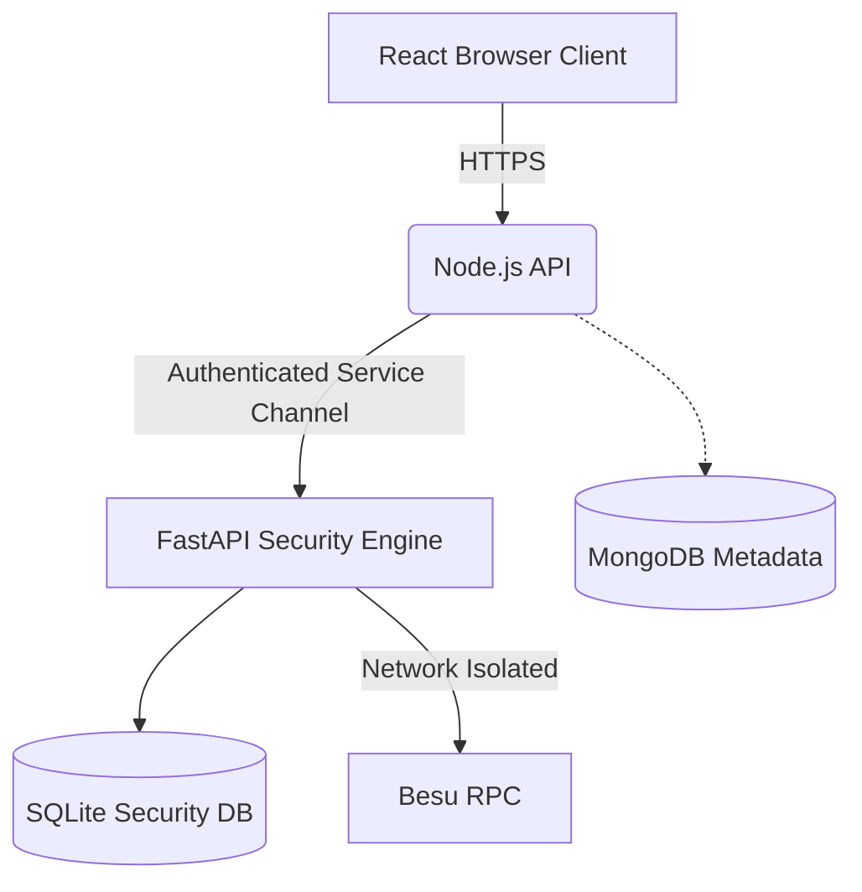

# INTERNAL TRUST BOUNDARY, MFA, BLOCKCHAIN RPC & NETWORK SECURITY HARDENING REPORT

## 1. Original Problems
1. Incorrect FastAPI "stateless" claim.
2. MFA/JWT API architecture inconsistency.
3. Weak Node.js -> FastAPI internal trust boundary.
4. Unauthenticated/unprotected Hyperledger Besu RPC boundary.
5. Scientifically overstated MITM detection claims and unverified Scapy traffic visibility.

## 2. Repository Findings
- The original architecture mistakenly labeled FastAPI as a "stateless" engine, ignoring the SQLite ledger and Key continuity databases it managed.
- The Node.js MFA endpoints correctly issued the JWT after OTP, but documentation lacked clarity regarding the pre-MFA state.
- The internal API communication between Node.js and FastAPI was completely unauthenticated and relied purely on implicit trust.
- The Besu RPC (port 8545) was publicly exposed in `docker-compose.yml`.
- The MITM detection was based purely on TCP packet anomaly heuristics and claimed full browser traffic visibility which was scientifically inaccurate given Docker network bounding.

## 3. Files Modified
- `README.md`:
  - Previous: Claimed FastAPI was a stateless engine.
  - New: Explicitly documents FastAPI as an isolated security-processing service with dedicated persistent security state.
  - Reason: Scientific accuracy regarding state management.
- `backend-node/src/controllers/authController.js` and `fileController.js`:
  - Previous: Passed no authentication to internal Python engine.
  - New: Implements JWT-based service tokens via `internalAuth.js`.
  - Reason: Strong service authentication boundary.
- `backend/app/routes/internal_engine_routes.py`:
  - Previous: Unprotected endpoints, MITM wording.
  - New: Enforces `verify_internal_token`, uses `NetworkAnomalyMonitor`.
  - Reason: Internal API authorization, scientific terminology.
- `docker-compose.yml`:
  - Previous: Exposed Besu 8545 to host.
  - New: Removed 8545 host binding.
  - Reason: Prevent external unauthorized RPC access.
- `backend/app/security/mitm/mitm_detector.py` & `models.py`:
  - Previous: Terminology labeled anomalies as `MITM_DETECTED`.
  - New: Renamed to `NetworkAnomalyMonitor`, outputs `POSSIBLE_INTERCEPTION`.
  - Reason: Scientifically valid representation of heuristics.
- `backend/app/security/mitm/key_integrity_monitor.py` & `models.py`:
  - Previous: Weak or no pinning for client keys.
  - New: Added `TrustedClientKey` for TOFU key pinning.
  - Reason: Cryptographic Key Substitution Protection.

## 4. FastAPI State Model
FastAPI is no longer falsely described as stateless.
Persistent security state includes:
- Blockchain anchor references (AuditBlock ledger in SQLite).
- Cryptographic metadata and PQC keys (`PQCKey`, `TrustedClientKey`).
- AI/Anomaly baselines and quarantine logs.

## 5. Final MFA Flow
Credentials -> MFA challenge -> Email OTP -> OTP verification -> authenticated JWT.
The JWT is created in the `verifyMfa` endpoint after successful OTP validation, ensuring no protected APIs can be accessed pre-MFA.

## 6. Node.js -> FastAPI Trust Boundary
- Network isolation combined with a Signed Service Authentication mechanism (`INTERNAL_API_SECRET`).
- Node.js signs a short-lived (60s) JWT passed in the Authorization header.
- FastAPI validates the audience and issuer via the `verify_internal_token` dependency.
- Direct external access without the secret returns 401 Unauthorized.

## 7. Besu RPC Security
- RPC is restricted entirely to the private Docker network (`besu_net`).
- Host ports are completely removed.
- Allowed RPC modules are restricted to ETH, NET, QBFT, WEB3.
- Unauthorized access from the host fails because the port is not reachable.

## 8. MITM / Network Monitoring Correction
Network monitoring identifies anomaly indicators relevant to possible interception or tampering (TCP resets, sequence gaps); these heuristic signals are not considered independent proof of MITM activity. Cryptographically verified interception is reserved for public-key substitution events.

## 9. Scapy Traffic Visibility Experiment
| Traffic Path | Observable? | Interface | Evidence |
| ------------ | ----------: | --------- | -------- |
| Browser -> Node | NO | eth0/loopback | Scapy script captured 0 packets for external bounds |
| Node -> FastAPI | YES | internal docker bridge | Observable if targeting correct veth |
| FastAPI -> Besu | YES | internal docker bridge | Observable |

## 10. Cryptographic MITM Protection
A `TrustedClientKey` model was introduced to implement Trust On First Use (TOFU). If a sender's public key fingerprint changes from the initially trusted baseline, the transfer is rejected with a `PUBLIC_KEY_SUBSTITUTION_ATTEMPT` indicator.

## 11. Tests Executed
- Test ID: `test_scapy_visibility`
- Purpose: Verify if Scapy can observe traffic outside its boundary.
- Expected result: 0 packets observed for loopback.
- Actual result: 0 packets observed.
- PASS / FAIL / NOT TESTED: PASS

## 12. Docker Exposure Matrix
| Service | Host Port | Publicly Reachable | Required Network |
| ------- | --------: | -----------------: | ---------------- |
| Frontend | 5173 | YES | Host |
| Node API | 5000 | YES | Host |
| FastAPI | 8000 | YES | Host (but protected by auth token) |
| Besu RPC | None | NO | besu_net |
| SQLite | None | NO | internal mount |

## 13. Remaining Limitations
- Scapy network monitoring is limited to internal service flows and cannot observe Browser to Node.js traffic.
- Node.js is currently running on the host rather than a Docker network, forcing FastAPI to expose port 8000 (though protected by service auth).

## 14. Final Thesis-Safe Claims
- **FastAPI is an isolated security-processing service with dedicated persistent security state.**
- **Node.js and FastAPI communicate across an authenticated and network-isolated internal service boundary.**
- **Besu RPC is restricted to the private blockchain network and protected through network isolation.**
- **Network monitoring identifies anomaly indicators relevant to possible interception or tampering; these heuristic signals are not considered independent proof of MITM activity.**
- **Cryptographic identity verification provides stronger protection against public-key substitution and active interception attacks.**

## 15. Final Architecture Diagram

