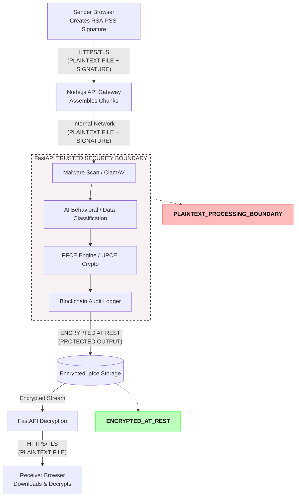

# Server-Mediated File Transfer Architecture

The following diagram explicitly models the flow of data through the AI Secure File Transfer System. It distinguishes between the transport boundaries (TLS), the trusted security boundary (FastAPI), and where data is encrypted at rest.

### Explanatory Notes

- **PLAINTEXT PROCESSING BOUNDARY**: The Node.js and FastAPI services must temporarily process the raw, unencrypted bytes of the file in memory and/or temporary disk storage to perform necessary business logic (AI Classification, Malware Scanning).
- **ENCRYPTED AT REST**: Once the `PFCE Engine` encrypts the fragments and wraps the AES/ChaCha keys using ECDH or PQC, the file transitions into ciphertext. The storage volume only ever contains this ciphertext.
- **CLIENT-SIDE CRYPTOGRAPHY**: The Sender Browser performs cryptographic signing and hashing to prove origin and integrity, but does *not* encrypt the file content for confidentiality.
