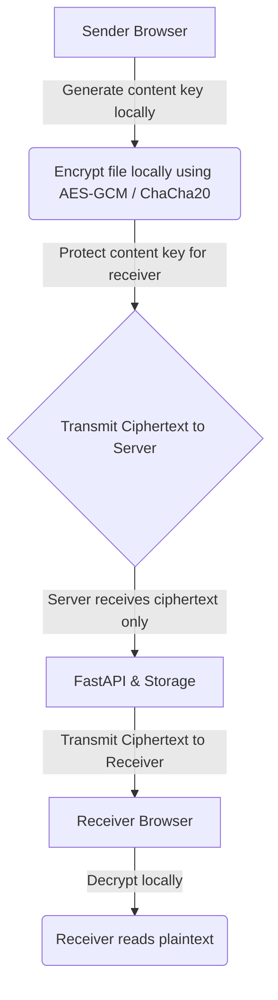

# True E2EE Migration Analysis

## Overview
This document analyzes the requirements and architectural consequences of migrating the current "Server-Mediated Encrypted Transfer" architecture to a **Strict End-to-End Encrypted (E2EE)** architecture. 

A Strict E2EE architecture dictates that the file payload must be encrypted on the sender's device before leaving the browser, and must remain entirely opaque to the intermediate servers (Node.js and FastAPI) until it is decrypted on the intended receiver's device.

## Required Architectural Changes

To achieve Strict E2EE, the following cryptographic flow must be implemented:

**Under Strict E2EE, the Server MUST NOT possess:**
- The content-encryption key.
- The receiver's private decryption key.
- Any representation of the plaintext file content.

## Architectural Consequences

Migrating to Strict E2EE would inherently conflict with several advanced security features currently provided by the trusted FastAPI backend. 

### 1. Malware Scanning (ClamAV)
- **Current State:** The server scans the plaintext payload for malware.
- **Strict E2EE Consequence:** The server-side ClamAV cannot inspect plaintext. Malware scanning would either need to be removed entirely, rely on purely heuristic metadata scanning, or be moved to the client-side browser (e.g., via WebAssembly ClamAV, which may be performance-prohibitive).

### 2. AI Data Classification & Entropy Analysis
- **Current State:** The server inspects the plaintext to determine if the data is highly sensitive and assigns a threat score.
- **Strict E2EE Consequence:** Server-side file classification becomes fundamentally limited. The server cannot read the bytes to determine their semantic meaning. Entropy analysis is also useless because all incoming E2EE ciphertext will have maximum entropy.

### 3. PFCE & UPCE Encryption
- **Current State:** The FastAPI server dynamically decides the encryption scheme (Polymorphic File Content Encryption) based on behavioral threat profiles and dynamically fragments the file.
- **Strict E2EE Consequence:** PFCE logic must move to the client side. The sender browser must be responsible for fragmentation and dynamic encryption, significantly increasing client-side code complexity.

### 4. Key Management & Recovery
- **Current State:** The server helps broker ECDH and manages policy-based decryption contexts.
- **Strict E2EE Consequence:** Receiver key management becomes more complex. If a receiver loses their device or private key, the server cannot help them recover the file because the server cannot decrypt it.

## Conclusion

Migrating to Strict E2EE fundamentally shifts the threat model from "Protect the Data from Storage/Network Compromise while Trusting the Compute Enclave" to "Zero-Trust in the Server". While this protects against a compromised FastAPI runtime, it necessitates abandoning or severely crippling the AI and malware scanning subsystems. 

*Note: This architecture is currently not implemented.*
